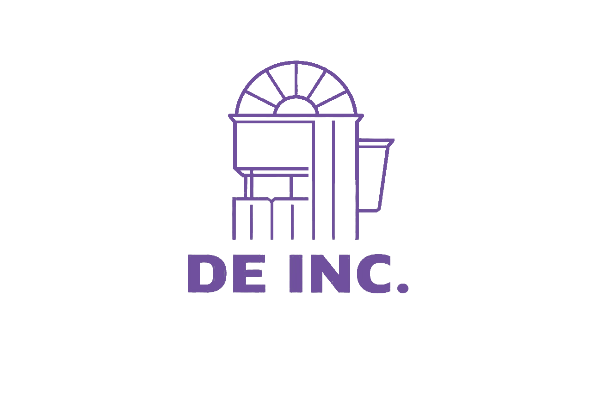
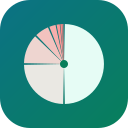

[github](https://github.com/happinessisreal) &nbsp;·&nbsp;
[projects](#projects) &nbsp;·&nbsp;
[stats](#stats)

> I build across the whole stack: compilers, optimisation services, 
> ML dashboards, 3D web and mobile apps.

I'm drawn to two things in particular: tools that speak **Bangla**, and systems 
where **math keeps the AI honest**. Most of what's below was built for a class, 
a hackathon or a friend, then polished until it was worth showing.

 **[alveelan](https://github.com/happinessisreal/alveelan)** &nbsp;·&nbsp; <samp>rust, llvm</samp> 
A programming language for kids, written in Bangla. Bangla keywords, Bangla 
digits and Bangla error messages, compiled to native code through LLVM.

 **[gridwise](https://github.com/happinessisreal/gridwise-energy-optimizer)** &nbsp;·&nbsp; <samp>python, fastapi, scipy</samp> 
An LLM turns operator notes into typed constraints, then an exact linear 
program finds the cheapest 24-hour energy plan. Built for BUP CSE Fest 2026.

 **[dhaka-aqi-dashboard](https://github.com/happinessisreal/dhaka-aqi-dashboard)** &nbsp;·&nbsp; <samp>flask, scikit-learn</samp> 
Air-quality monitoring and next-hour PM2.5 forecasting for Dhaka, 
on OpenAQ data, with a live dashboard.

 **[doofen](https://github.com/happinessisreal/doofen)** &nbsp;·&nbsp; <samp>astro, react three fiber</samp> 
A scroll-driven 3D agency site. A wireframe building assembles as you 
scroll, and a built-in CMS manages the portfolio.

 **[scormplayer](https://github.com/happinessisreal/scormplayer)** &nbsp;·&nbsp; <samp>javascript, vite</samp> 
A test harness for e-learning packages. It validates them against the ADL 
schemas and logs every LMS API call live.

 **[bup-diary](https://github.com/happinessisreal/bup-diary)** &nbsp;·&nbsp; <samp>flutter, supabase, gemini</samp> 
An AI journal you can talk to. It finds your most relevant past entry 
before it answers.

 **[swing-expense-tracker](https://github.com/happinessisreal/swing-expense-tracker)** &nbsp;·&nbsp; <samp>java, swing</samp> 
A desktop finance tracker with charts and salted-hash accounts.

 **[Goriber-Habit-Tracker](https://github.com/happinessisreal/Goriber-Habit-Tracker)** &nbsp;·&nbsp; <samp>c11</samp> 
A terminal study tracker with no dependencies: pomodoro, streaks and stats.

the logos are philosophy jokes

 

<samp>gridwise</samp>: the best of all possible grids, a bolt striking the one optimal 
vertex of the feasible polytope (Leibniz, via Voltaire). 
<samp>alveelan</samp>: "এটি অ নয়", this is not অ (Magritte). 
<samp>dhaka-aqi</samp>: an ouroboros. The recursive forecast feeds on its own predictions. 
<samp>scormplayer</samp>: the play button is a Penrose triangle, like full SCORM compliance. 
<samp>bup-diary</samp>: The False Mirror, a diary that looks back. 
<samp>expense-tracker</samp>: Zeno's budget. Spend half of what's left, forever. 
<samp>habit-tracker</samp>: one must imagine Sisyphus happy.

<samp>python &nbsp; rust &nbsp; typescript &nbsp; dart &nbsp; java &nbsp; c &nbsp; fastapi &nbsp; flask &nbsp; scikit-learn &nbsp; llvm &nbsp; astro &nbsp; three.js &nbsp; flutter &nbsp; supabase &nbsp; docker</samp>

Every graphic here is generated in this repository. None of it is embedded 
from anyone else's server, so nothing here can rate-limit or go dark.

`ascii.svg` is the whole picture turned into characters by 
[`scripts/make_portrait.py`](scripts/make_portrait.py). Each character's density follows brightness, 
and its colour is one of ten k-means clusters of the image. That gives every region 
one deliberate colour instead of per-character noise.

The stats and these section headings are drawn by [a scheduled action](.github/workflows/stats.yml) 
from the GitHub GraphQL API once a day, and it commits only what changed. The day 
window is pinned to whole UTC days and only public repositories are counted, 
so the output is identical no matter who runs it.

The graphics animate with SMIL inside the SVG, because GitHub strips scripts 
and CSS from READMEs. For the same reason, the typeface is [JetBrains Mono](scripts/fonts), 
subset and inlined as base64 in every file. 
<samp>year.svg</samp> uses the portrait's character ramp, quiet to loud: <samp>· : + # @</samp>
