[site](https://happinessisreal.github.io) &nbsp;·&nbsp; [writeups](https://happinessisreal.github.io/writeups) &nbsp;·&nbsp; [projects](#projects) &nbsp;·&nbsp; [activity](#activity)

 
 
 
 

<samp>cat ~/projects/*/LOGO.md</samp>: the logos are philosophy jokes

 

<samp>gridwise</samp>: the best of all possible grids, a bolt striking the one optimal vertex of the feasible polytope (Leibniz, via Voltaire). 
<samp>alveelan</samp>: "এটি অ নয়", this is not অ (Magritte). 
<samp>dhaka-aqi</samp>: an ouroboros. The recursive forecast feeds on its own predictions. 
<samp>scormplayer</samp>: the play button is a Penrose triangle, like full SCORM compliance. 
<samp>bup-diary</samp>: The False Mirror, a diary that looks back. 
<samp>expense-tracker</samp>: Zeno's budget. Spend half of what's left, forever. 
<samp>habit-tracker</samp>: one must imagine Sisyphus happy.

